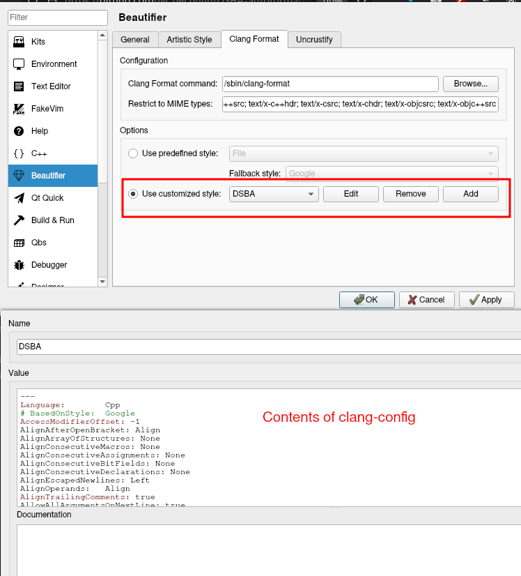
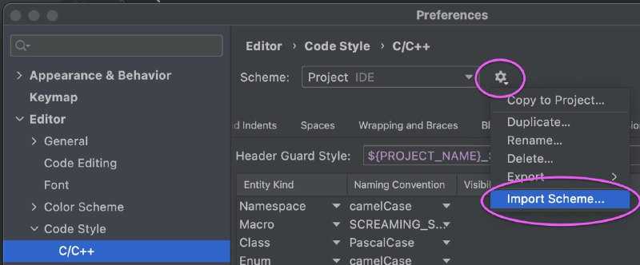
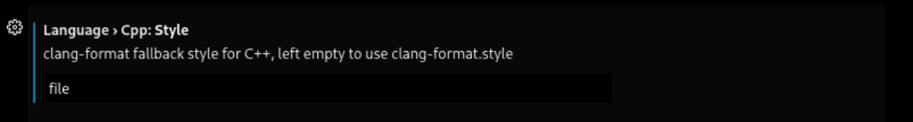

# DSBA-autoformatting-setup
A small guide on setting up an autoformatter for DSBA C++ course

## Qt Creator

1. Download `qtcreator.xml` file from this repo
2. Go to tools -> options -> C++ -> code style
3. Click import and choose the downloaded file

<!--
1. Download `clang-config` file from this repo
2. Go to Qt creator -> settings -> ... -> code style
3. Click import and choose the downloaded `clang-config` file
-->



## CLion

1. Download `clion.xml` file from this repo
2. Go to settings -> editor -> code style -> C/C++
3. Import the formatting scheme (choose your downloaded xml file)



## VSCode & others

This only applies for VSCode (not Visual Studio) and Mac/Linux. Sorry, Windows users, you have to figure this out on your own (contributions are welcome btw)

1. Download `clang-config` file from this repo
2. Rename it into `.clang-format` (the file will probably become invisible but it's there)
3. Move it into a folder inside your PATH (PATH is an environment variable, you can google which folders are included in it, or how to add a folder in it)

### If you use VSCode

1. Download `clang-format` extension
2. Go to settings -> extensions -> clang-format
3. Find an option called "Language > Cpp: Style" and type "`file`" in the box



### If you use something else

This is basically the last resort. You will have to do it from terminal if you're on Mac/Linux but so be it.
For me you are a hero.

You have to install `clang-format` package (if you haven't yet). Formatting a file is simple from the terminal:

```
clang-format --style=file yourfile.cpp > yourfile.cpp
```

You only have to change `yourfile` to your actual filename :)

