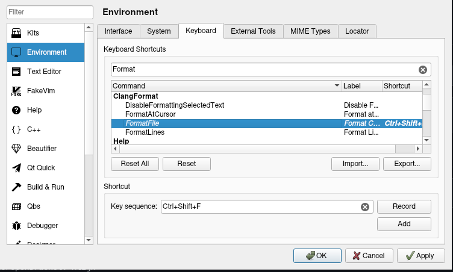

# DSBA-autoformatting-setup
A small guide on setting up an autoformatter for DSBA C++ course

## Qt Creator

0. Install Clang: [Windows](https://llvm.org/builds/), for other OSes plz google
1. Go to Help -> About plugins -> find a plugin named `Beautifier` (in Russian it's Справка -> о модулях -> Стилизатор or something like that)
2. Enable it and reload Qt Creator
3. Go to tools -> options -> Beautifier
4. In "general" tab set the default tool to ClangFormat
5. Go to "Clang Format" tab
6. In the options tab click on "use customized style" and add a new style
7. Paste contents of `clang-config` file in the first textbox (the file is in this repository)


8. Go to options -> Environment -> Keyboard
9. Find the "FormatFile" action in "ClangFormat" category (it's important) and set a shortcut for formatting the whole file



## CLion

1. Download `clion.xml` file from this repo
2. Go to settings -> editor -> code style -> C/C++
3. Import the formatting scheme (choose your downloaded xml file)


## VSCode & others

This only applies for VSCode (not Visual Studio) and Mac/Linux. Sorry, Windows users, you have to figure this out on your own (contributions are welcome btw)

1. Download `clang-config` file from this repo
2. Rename it into `.clang-format` (the file will probably become invisible but it's there)
3. Move it into a folder inside your PATH (PATH is an environment variable, you can google which folders are included in it, or how to add a folder in it)

### If you use VSCode

1. Download `clang-format` extension
2. Go to settings -> extensions -> clang-format
3. Find an option called "Language > Cpp: Style" and type "`file`" in the box


### If you use something else

This is basically the last resort. You will have to do it from terminal if you're on Mac/Linux but so be it.
For me you are a hero.

You have to install `clang-format` package (if you haven't yet). Formatting a file is simple from the terminal:

```
clang-format --style=file yourfile.cpp > yourfile.cpp
```

You only have to change `yourfile` to your actual filename :)

## PS

- Huge thanks to [Miv2nir](https://github.com/Miv2nir) for adapting the clang-format config for Windows and for persistent struggle with Qt configuration
- Don't hesitate to give my other repos a star I really need them...
